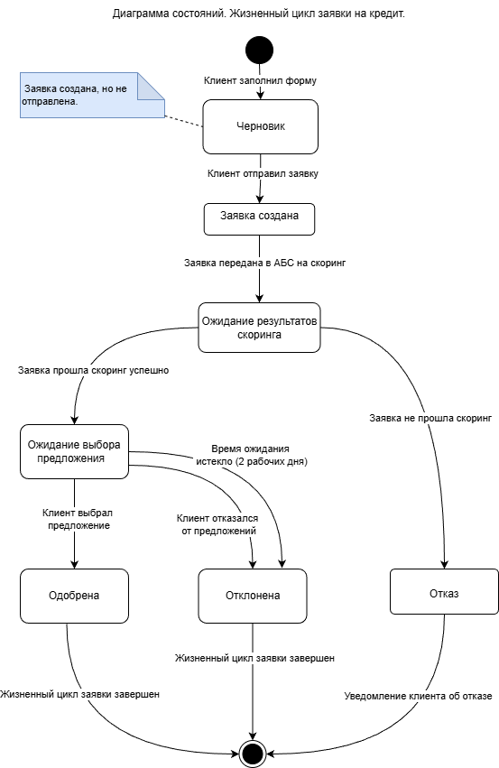
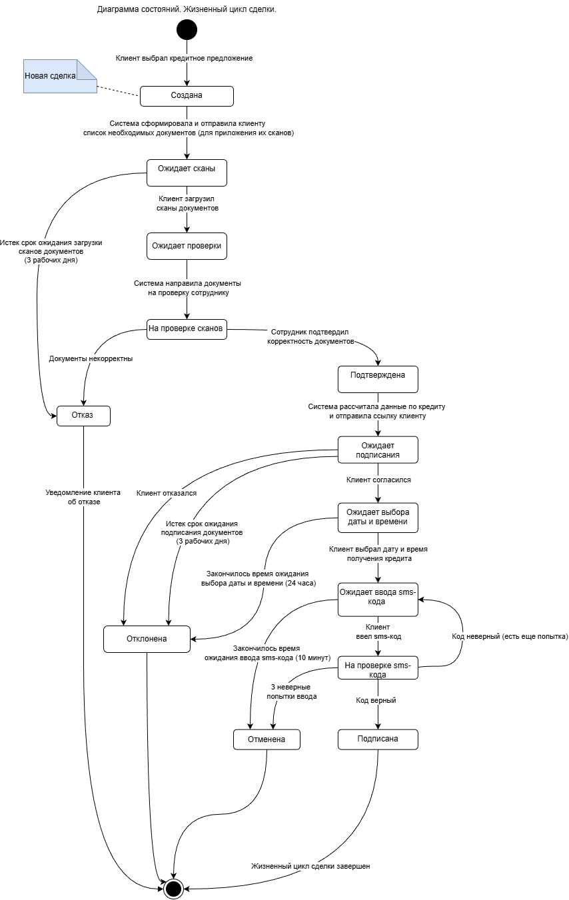
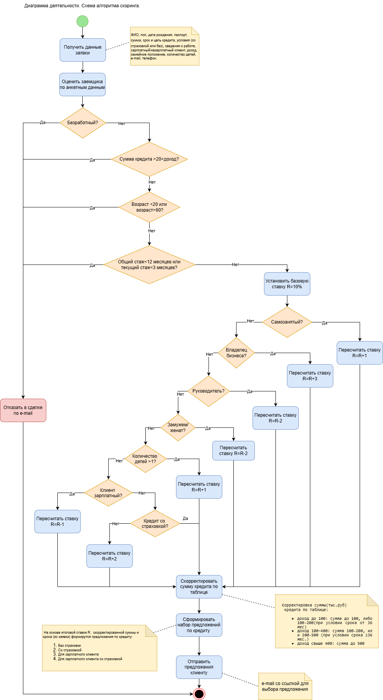

# 3. Диаграммы состояний и деятельности (UML)

В этом разделе представлены диаграммы, описывающие жизненный цикл заявки и сделки, а также алгоритм скоринга.

---

## 3.1 Диаграмма состояний «Заявки на кредит»

На диаграмме показаны все возможные состояния заявки и переходы между ними — от создания до отказа или формирования сделки.

---

## 3.2 Диаграмма состояний «Сделки»

Диаграмма отражает жизненный цикл сделки: от создания до подписания или отмены.

---

## 3.3 Диаграмма деятельности «Скоринга»

Алгоритм автоматической оценки кредитоспособности клиента на основе анкетных данных.

---

## 3.4 Текстовое описание алгоритма скоринга

### Входные данные

На вход алгоритм получает анкетные данные заявки:

- Личные данные: ФИО, пол, дата рождения, паспорт, семейное положение, количество детей, телефон, email
- Параметры кредита: сумма, срок, страховка, цель
- Сведения о работе: статус занятости, должность, доход, стаж, признак зарплатного клиента

### Основная часть

Алгоритм выполняет проверку отказных условий:

| Условие | Действие |
|---------|----------|
| Рабочий статус «Безработный» | Отказ |
| Сумма займа > 20 ежемесячных доходов | Отказ |
| Возраст < 20 или > 60 лет | Отказ |
| Общий стаж < 12 месяцев | Отказ |
| Текущий стаж < 3 месяцев | Отказ |

Если отказных условий нет, устанавливается базовая ставка **10%**, которая корректируется в зависимости от факторов:

| Фактор | Условие | Изменение ставки |
|--------|---------|------------------|
| Рабочий статус | Самозанятый | +1% |
| Рабочий статус | Владелец бизнеса | +3% |
| Должность | Руководитель | –2% |
| Семейное положение | В браке | –2% |
| Количество детей | Больше 1 | +1% |
| Зарплатный клиент | Да | –1% |
| Страховка | Нет | +2% |

### Корректировка суммы

В зависимости от дохода и срока кредита допустимая сумма корректируется по матрице лимитов.

### Формирование предложений

На основе итоговой ставки и скоректированной суммы формируются 4 варианта кредита:

1. Без страховки
2. Со страховкой
3. Для зарплатного клиента
4. Для зарплатного клиента со страховкой

### Выход из алгоритма

- Если отказ — клиенту отправляется email с уведомлением
- Если одобрение — клиенту отправляется email со ссылкой на выбор предложений

---

## Исходные файлы

Диаграммы построены в draw.io. Исходные файлы (.drawio) находятся в папке:

- [Исходники UML-диаграмм](../diagrams/uml/)
