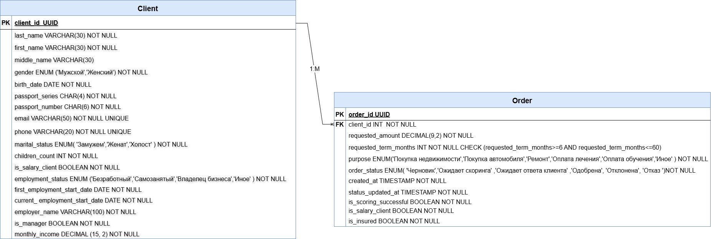

# 4. Модель данных (ER-диаграмма)

В этом разделе представлена ER-диаграмма, описывающая сущности «Заявка» и «Клиент», их атрибуты и связи между ними.

---

## 4.1 ER-диаграмма «Заявка и Клиент»

На диаграмме показаны основные сущности, их атрибуты, типы данных, первичные ключи и связи.

---

## 4.2 Описание сущностей

### Сущность «Клиент»

Хранит персональные данные клиента, заполненные при подаче заявки.

| Атрибут | Тип данных | Обязательность | Первичный ключ |
|---------|------------|----------------|----------------|
| client_id | UUID | Да | Да |
| last_name | VARCHAR(30) | Да | Нет |
| first_name | VARCHAR(30) | Да | Нет |
| middle_name | VARCHAR(30) | Нет | Нет |
| gender | ENUM | Да | Нет |
| birth_date | DATE | Да | Нет |
| passport_series | CHAR(4) | Да | Нет |
| passport_number | CHAR(6) | Да | Нет |
| email | VARCHAR(50) | Да | Нет |
| phone | VARCHAR(20) | Да | Нет |
| marital_status | ENUM | Да | Нет |
| children_count | INT | Да | Нет |
| is_salary_client | BOOLEAN | Да | Нет |
| employment_status | ENUM | Да | Нет |
| first_employment_start_date | DATE | Нет | Нет |
| current_employment_start_date | DATE | Нет | Нет |
| employer_name | VARCHAR(100) | Нет | Нет |
| is_manager | BOOLEAN | Да | Нет |
| monthly_income | DECIMAL(15,2) | Да | Нет |

### Сущность «Заявка»

Хранит данные кредитной заявки, параметры кредита и статус обработки.

| Атрибут | Тип данных | Обязательность | Первичный ключ |
|---------|------------|----------------|----------------|
| application_id | UUID | Да | Да |
| client_id | UUID | Да | Нет (FK) |
| amount | DECIMAL(15,2) | Да | Нет |
| term_months | INT | Да | Нет |
| loan_purpose | VARCHAR(50) | Да | Нет |
| with_insurance | BOOLEAN | Да | Нет |
| status | VARCHAR(30) | Да | Нет |
| created_at | TIMESTAMP | Да | Нет |
| updated_at | TIMESTAMP | Да | Нет |
| scoring_result | VARCHAR(30) | Нет | Нет |
| interest_rate | DECIMAL(5,2) | Нет | Нет |

---

## 4.3 Связи между сущностями

- **Клиент** → **Заявка**: один клиент может иметь несколько заявок (связь «один ко многим»)
- Поле `client_id` в таблице Заявка является внешним ключом, ссылающимся на `client_id` в таблице Клиент

---

## Исходные файлы

Диаграмма построена в draw.io. Исходные файлы (.drawio) находятся в папке:

- [Исходники ER-диаграммы](../diagrams/er/)
