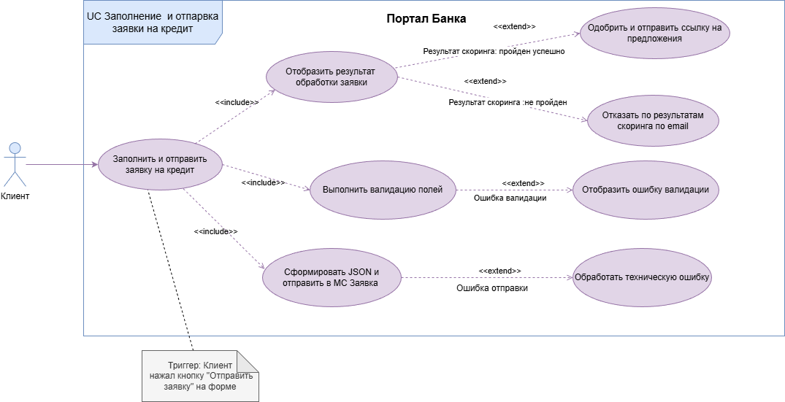

# 7. Use Case (Сценарий использования)

В этом разделе представлен сценарий использования системы — подача клиентом онлайн-заявки на кредит.

---

## 7.1 Диаграмма прецедентов

На диаграмме показано взаимодействие актора (Клиент) с системой при подаче заявки.

---

## 7.2 Текстовое описание Use Case

| Элемент | Описание |
|---------|----------|
| **Название** | Заполнение и отправка заявки на кредит |
| **Назначение** | Подача клиентом онлайн-заявки на кредит через портал банка |
| **Акторы** | Клиент |
| **Предусловия** | Клиент открыл портал банка или перешёл по ссылке из письма |
| **Триггер** | Нажатие кнопки «Отправить заявку» |

---

### Основной сценарий

1. Клиент переходит на страницу подачи заявки
2. Клиент заполняет все обязательные поля формы:
   - Фамилия, имя, отчество (при наличии)
   - Пол
   - Дата рождения (не младше 18 лет)
   - Серия и номер паспорта
   - Email и телефон
   - Семейное положение и количество детей
   - Рабочий статус, место работы, должность
   - Ежемесячный доход
   - Признак зарплатного клиента
   - Сумма кредита (от 10 000 до 500 000 руб.)
   - Срок кредита (от 6 до 60 месяцев)
   - Цель кредита
3. Клиент нажимает кнопку «Отправить заявку»
4. Система проверяет корректность заполнения всех полей
5. Данные отправляются в МС Заявка (Метод 1)
6. МС Заявка создаёт заявку и вызывает:
   - МС Клиент (создание клиента)
   - МС Скоринг (оценка заявки)
   - МС Нотификация (отправка email)
7. Клиент получает email с результатом рассмотрения заявки

---

### Альтернативные потоки

**А1: Ошибка валидации**
- Если какое-то поле заполнено неверно, система подсвечивает его и показывает сообщение об ошибке
- Клиент исправляет ошибку и повторяет попытку

**А2: Отказ по скорингу**
- Если МС Скоринг возвращает отказ, клиенту отправляется email с уведомлением
- На портале отображается соответствующий статус заявки

**А3: Технический сбой**
- Если сервис недоступен, система показывает сообщение об ошибке
- Клиент может повторить попытку позже

---

### Постусловия

**Успешное завершение:**
- Заявка создана в системе
- Данные клиента сохранены в МС Клиент
- Проведён скоринг
- Клиенту отправлено уведомление на email

**Неуспешное завершение:**
- Заявка не создана
- Данные не сохранены
- Клиенту показано сообщение об ошибке

---

## Полный Use Case

Подробное описание всех альтернативных потоков и примеров доступно в сводном документе:

[Проектная работа (полная версия)](<../original_files/Проектная работа.docx>)

