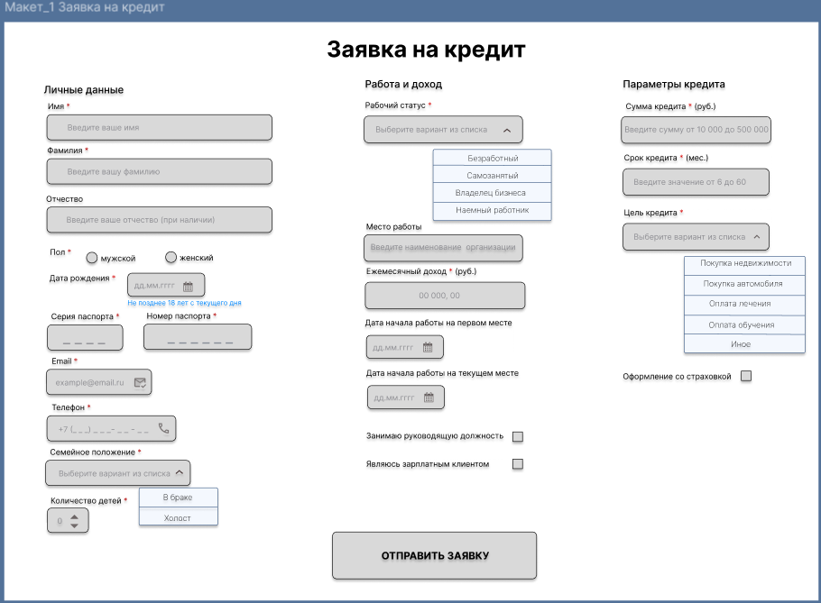
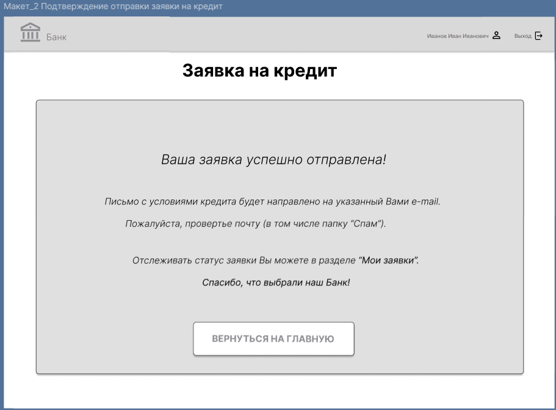
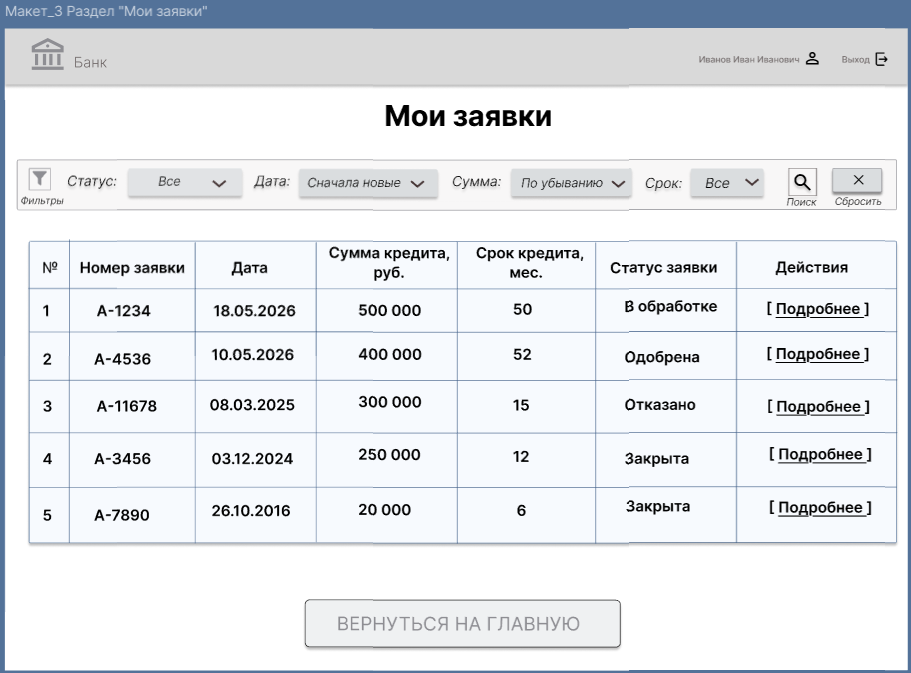

# 8. Макеты экранных форм

В этом разделе представлены макеты экранных форм для клиентской части портала. Макеты разработаны в Figma и отображают последовательность действий клиента при подаче заявки на кредит.

---

## 8.1 Макет 1 — Заполнение заявки на кредит

На данной форме клиент вводит все необходимые данные для подачи заявки: личные данные, паспортные данные, сведения о работе и параметры кредита.

### Описание полей формы

| № | Наименование реквизита | Тип данных | Обязательность | Описание |
|---|------------------------|------------|----------------|----------|
| 1 | Имя | Текстовый (кириллица) | Да | 2–30 символов |
| 2 | Фамилия | Текстовый (кириллица) | Да | 2–30 символов |
| 3 | Отчество | Текстовый (кириллица) | Нет | 2–30 символов |
| 4 | Пол | Переключатель | Да | Мужской / Женский |
| 5 | Дата рождения | Дата (дд.мм.гггг) | Да | Не младше 18 лет |
| 6 | Серия паспорта | Числовой (4 цифры) | Да | Только цифры |
| 7 | Номер паспорта | Числовой (6 цифр) | Да | Только цифры |
| 8 | Email | Текстовый (email) | Да | Формат: example@mail.ru |
| 9 | Телефон | Текстовый (маска) | Да | +7 (XXX) XXX-XX-XX |
| 10 | Семейное положение | Выпадающий список | Да | В браке / Холост |
| 11 | Количество детей | Числовой | Да | ≥ 0 |
| 12 | Рабочий статус | Выпадающий список | Да | Наемный работник / Самозанятый / Владелец бизнеса / Безработный |
| 13 | Место работы | Текстовый | Нет | Наименование организации |
| 14 | Ежемесячный доход | Числовой | Да | В рублях |
| 15 | Дата начала работы на первом месте | Дата | Да | Для расчёта стажа |
| 16 | Дата начала работы на текущем месте | Дата | Да | Для расчёта стажа |
| 17 | Занимаю руководящую должность | Чекбокс | Да | Да / Нет |
| 18 | Являюсь зарплатным клиентом | Чекбокс | Да | Да / Нет |
| 19 | Сумма кредита | Числовой | Да | 10 000 – 500 000 руб. |
| 20 | Срок кредита | Числовой | Да | 6 – 60 месяцев |
| 21 | Цель кредита | Выпадающий список | Да | Покупка недвижимости / автомобиля / оплата лечения / обучения / иное |
| 22 | Оформление со страховкой | Чекбокс | Да | Да / Нет |
| 23 | Кнопка «Отправить заявку» | Действие | — | Активна при заполнении всех обязательных полей |

---

## 8.2 Макет 2 — Подтверждение отправки заявки

После успешной отправки заявки клиенту отображается экран с подтверждением и номером заявки.

### Описание полей формы

| № | Наименование реквизита | Тип данных | Описание |
|---|------------------------|------------|----------|
| 1 | Сообщение об успешной отправке | Текстовый | «Ваша заявка успешно отправлена!» |
| 2 | Сообщение об отправке письма | Текстовый | «Письмо с условиями кредита будет направлено на указанный email» |
| 3 | Сообщение об отслеживании статуса | Текстовый | «Отслеживать статус заявки вы можете в разделе "Мои заявки"» |
| 4 | Сообщение с благодарностью | Текстовый | «Спасибо, что выбрали наш Банк!» |
| 5 | Кнопка «Вернуться на главную» | Действие | Возврат на главную страницу портала |

---

## 8.3 Макет 3 — Раздел «Мои заявки» (проверка статуса)

В этом разделе клиент может отслеживать статус поданных заявок.

### Описание полей формы

| № | Наименование реквизита | Тип данных | Описание |
|---|------------------------|------------|----------|
| 1 | Фильтр «Статус» | Выпадающий список | Все / В обработке / Одобрена / Отказано / Закрыта |
| 2 | Фильтр «Дата» | Выпадающий список | Все / Сначала новые / Сначала старые |
| 3 | Фильтр «Сумма кредита» | Выпадающий список | Все / По убыванию / По возрастанию |
| 4 | Фильтр «Срок кредита» | Выпадающий список | Все / до 12 мес. / 12–36 мес. / 36–60 мес. |
| 5 | Кнопка «Поиск» | Действие | Применение фильтров |
| 6 | Кнопка «Сбросить» | Действие | Сброс всех фильтров |
| 7 | Номер строки | Числовой | Порядковый номер записи |
| 8 | Номер заявки | Текстовый | Уникальный идентификатор заявки |
| 9 | Дата создания | Дата (дд.мм.гггг) | Дата подачи заявки |
| 10 | Сумма кредита | Числовой | Сумма в рублях |
| 11 | Срок кредита | Числовой | Срок в месяцах |
| 12 | Статус заявки | Текстовый | В обработке / Одобрена / Отказано / Закрыта |
| 13 | Действия | Кнопка-ссылка | Переход к деталям заявки |

---

## Исходные файлы макетов

Макеты разработаны в Figma. Исходные файлы доступны по ссылке:

- [Макеты в Figma](https://figma.com/...)

---

## Полное описание макетов

Детальное описание всех реквизитов экранных форм доступно в сводном документе:

- [Сводный проектный документ](../original_files/Проектная_работа.docx)
